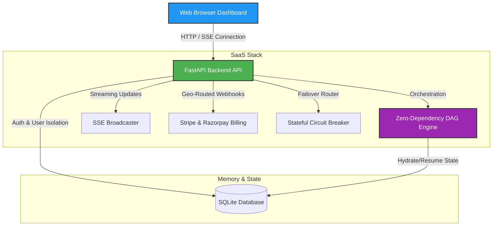

# Agentic SaaS Boilerplate

> **IMPORTANT**: This repository contains real, production-ready, battle-tested code extracted directly from active commercial systems (like Agency OS or Founder Growth OS), rather than simplified mock learning artifacts.
>
> For project walkthroughs, architecture flowcharts, and system context, visit the live landing page: [shubham0086.github.io/MyPortfolio.github.io/projects/agent-saas.html](https://shubham0086.github.io/MyPortfolio.github.io/projects/agent-saas.html)

> **Launch multi-agent-powered SaaS products today, not prototypes.**

[](LICENSE)
[](requirements.txt)
[](package.json)
[](requirements.txt)

I built [Agency OS](https://github.com/shubham0086/agency-os) on this engine: a 6-agent marketing platform that runs internally today. This repo is that engine, extracted and packaged so you can build your own.

Most AI SaaS tutorials show you how to call an API. They skip the parts that actually take weeks: scheduling agents in parallel, streaming live status to the UI without polling, handling payments from two continents, and keeping the system alive when an LLM goes down. This boilerplate solves all four.

Clone it. Swap the mock agents for your real logic. Ship.

---

## What You Can Build With This

Agency OS (marketing agency automation) is one application. The engine fits any agentic SaaS:
- Content pipeline (research → write → QA → publish)
- Code review automation (analyze → suggest → summarize)
- Lead enrichment (scrape → enrich → score → route)
- Any multi-step AI workflow that needs real-time feedback and billing

See Agency OS for a full production example built on this exact stack: [github.com/shubham0086/agency-os](https://github.com/shubham0086/agency-os)

---

## 🏗️ System Architecture Flow

The template features a FastAPI backend gateway coordinating execution states, database persistence, and external webhook security, linked to a real-time glassmorphic dashboard:



---

## What This Solves

### DAG Scheduler (`dag_engine.py`)
Linear agent chains break when you need parallel execution. This is a zero-dependency Python DAG scheduler using Kahn's Algorithm: runs Planner first, then Copywriter and ImageGenerator in parallel, then Verifier only after both finish. State passes between nodes as a typed dict. No Celery, no external dependencies.

### SSE Streaming (`sse_broadcaster.py`)
Agent workflows take 15-90 seconds. Polling is terrible UX. This broadcasts live node status transitions (`planning → writing → complete`) and per-node token costs directly to the browser via Server-Sent Events at sub-100ms latency. The dashboard visualizes the DAG in real time.

### Geo-Routed Billing (`billing_router.py`)
Stripe doesn't work well for INR payments. Razorpay doesn't work for USD. This router sends international payments to Stripe and Indian payments to Razorpay: both with HMAC-SHA256 signature verification in constant time (no timing attack vectors). One webhook endpoint handles both.

---

## ⚡ Quick Start: Free Local Sandbox

This boilerplate includes a **"Zero-Cost Sandbox Mode"**. You can boot and test the entire streaming dashboard, mock LLM runs, and billing webhooks locally without setting up paid API keys.

### 1. Clone & Boot Containers
Build and start the services using Docker:
```bash
git clone https://github.com/shubham0086/agent-saas-boilerplate
cd agent-saas-boilerplate
docker-compose up --build
```
*   FastAPI backend runs at: `http://localhost:8000`
*   Client Dashboard runs at: `http://localhost:3000`

### 2. Run Locally (Without Docker)
If you don't have Docker installed:
```bash
# Start backend
cd backend
python -m venv venv
source venv/bin/activate
pip install -r requirements.txt
uvicorn main:app --reload

# Start frontend (in a separate terminal)
cd ..
npx serve -s frontend -l 3000
```

### 3. Trigger Mock Payment Webhooks
To verify webhook ingestion, signature validation, and database updates, run our webhook simulator script:
```bash
npm run test:mock-webhooks
```

---

## 📚 Step-by-Step Learning Modules

Every technique in this boilerplate is fully explained inside standalone learning markdown files. Read them to learn the engineering principles:

*   **[Module 01: Designing and Coding a Zero-Dependency DAG Agent Scheduler](docs/01-dag-agent-scheduler.md)**
*   **[Module 02: Implementing Real-Time Observability Streaming (FastAPI + SSE)](docs/02-fastapi-sse-streaming.md)**
*   **[Module 03: Setting up Geo-Routed Dual Billing (Stripe + Razorpay)](docs/03-stripe-razorpay-securing.md)**
*   **[Future Plans & Roadmap: Advanced Scaling Techniques](docs/future-plans.md)**

---

## 🎯 Production Engineering Highlights

- **Timing Attack Mitigation**: Signature verifications use `hmac.compare_digest` to prevent timing-analysis exploits when validating webhooks.
- **Circuit Breaker Failover**: Out-of-the-box `circuit_breaker.py` wrapper that halts outbound API calls to failing models and falls back to secondary options.
- **Sovereign Agent Isolation**: SQLite structures separate active run logs, workspace directories, and user account parameters to enforce multi-user sandboxing.
